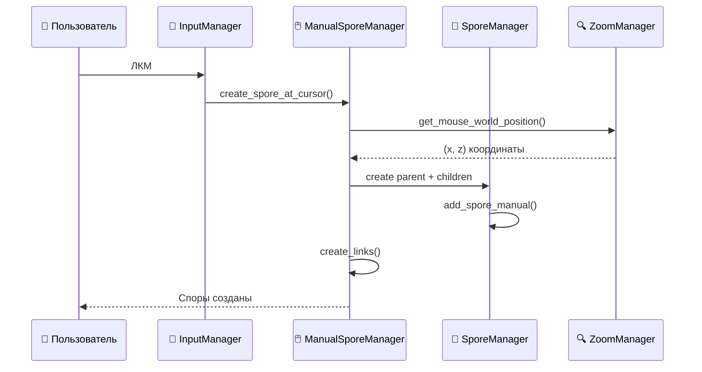

# 📂 Исходный код (src) — v13_manual

> 🎮 **Система ручного создания спор с интерактивным превью**

Эта директория содержит весь исходный код проекта "Споры" версии 13_manual. Архитектура построена на принципах чистого кода с четким разделением ответственности между слоями.


## 🏗️ Архитектурная схема v13_manual

```mermaid
graph TB
    subgraph "🖱️ v13_manual: Manual Input System"
        ManualSporeManager["`🎮 ManualSporeManager`<br/>Ручное создание спор"]
        CursorPreview["`👻 Cursor Preview`<br/>Полупрозрачная спора"]
        MouseHandler["`🖱️ Mouse Handler`<br/>Обработка ЛКМ"]
        PredictionChain["`🔮 Prediction Chain`<br/>Min/Max управление"]
    end

    subgraph "⚡ Enhanced Managers"
        InputManager["`🎹 InputManager`<br/>+ ЛКМ обработка"]
        UpdateManager["`🔄 UpdateManager`<br/>+ Cursor updates"]
        SporeManager["`🧬 SporeManager`<br/>+ Manual mode"]
    end

    subgraph "🧠 Core Integration Layer"
        Spore["`🌟 Spore`<br/>Logic + Visual"]
        SporeLogic["`📐 SporeLogic`<br/>Чистая математика"]
        SporeVisual["`🎨 SporeVisual`<br/>3D представление"]
    end

    subgraph "🔬 Pure Logic Layer"
        PendulumSystem["`⚖️ PendulumSystem`<br/>Физическая модель"]
        CostFunction["`💰 CostFunction`<br/>Функция стоимости"]
        Optimizer["`🎯 SporeOptimizer`<br/>L-BFGS-B + DE"]
        PoissonDisk["`🎲 Poisson Disk`<br/>Равномерная генерация"]
    end

    subgraph "🎨 Visual Layer"
        UISetup["`📱 UI_setup`<br/>Готовые интерфейсы"]
        SceneSetup["`🏗️ SceneSetup`<br/>3D сцена"]
        CostVisualizer["`🗻 CostVisualizer`<br/>3D поверхность"]
    end

    ManualSporeManager --> CursorPreview
    ManualSporeManager --> PredictionChain
    ManualSporeManager --> SporeManager
    
    InputManager --> ManualSporeManager
    UpdateManager --> ManualSporeManager
    
    SporeManager --> Spore
    Spore --> SporeLogic
    Spore --> SporeVisual
    
    SporeLogic --> PendulumSystem
    SporeLogic --> CostFunction
    SporeManager --> Optimizer
    
    UISetup --> SceneSetup
    CostVisualizer --> CostFunction
```

## 📁 Структура директорий

### 🧠 **`core/`** — Интеграционное ядро
> Объединяет логику и визуализацию в единые сущности

```python
# Главный интегрирующий класс проекта
core/spore.py           # 🌟 Spore = SporeLogic + SporeVisual
core/simulation_engine.py  # 🎮 Альтернативный движок (не используется в main_demo)
```

**Ключевые концепции:**
- **Агрегация логики и визуализации** в одном объекте
- **Синхронизация** между 2D математикой и 3D отображением
- **Обратная совместимость** с существующим API

### 🔬 **`logic/`** — Чистая математика
> Независимые от Ursina алгоритмы и вычисления

```python
logic/pendulum.py           # ⚖️ Система маятника + кэширование матриц
logic/spore_logic.py        # 🧬 Логика споры (состояние, эволюция, стоимость)
logic/cost_function.py      # 💰 Расчет стоимости и градиента  
logic/spawn_area.py         # 🎯 Эллиптическая область + диски Пуассона
logic/ghost_processor.py    # 👻 Эффективный расчет предсказаний
logic/optimizer.py          # 🎯 L-BFGS-B и Differential Evolution
```

**Математические основы:**
- **Линеаризация и дискретизация** нелинейной системы
- **Оптимизация управления** с ограничениями
- **Пуассоновы диски** для равномерного размещения
- **Кэширование вычислений** для производительности

### 🎨 **`visual/`** — 3D визуализация и UI
> Все что связано с отображением в Ursina

#### 🎭 Основные визуальные компоненты:
```python
visual/spore_visual.py      # 🌟 Базовое 3D представление споры
visual/scene_setup.py       # 🏗️ Инициализация сцены (камера, свет)
visual/cost_visualizer.py   # 🗻 3D поверхность стоимости с контурами
visual/spawn_area_visualizer.py  # 🎯 Визуализация эллиптической области
visual/prediction_visualizer.py  # 🔮 "Призраки" и их траектории
visual/link.py              # 🔗 Визуальные связи между спорами
visual/frame.py             # 📐 Система координат (оси X,Y,Z)
visual/pillar.py            # 🏛️ Столбы для визуализации стоимости
```

#### 📱 UI система:
```python
visual/ui_setup.py          # 🎨 Готовые настройки UI для демо
visual/ui_manager.py        # 📝 Менеджер текстовых элементов
visual/ui_constants.py      # 📐 Константы позиций для разных мониторов
```

**UI особенности v13_manual:**
- **Адаптивные позиции** под разные мониторы
- **Готовые настройки** для быстрого создания демо
- **Колбэк система** для динамического обновления

### 🎮 **`managers/`** — Менеджеры подсистем
> Классы-оркестраторы глобальных систем

#### 🆕 v13_manual менеджеры:
```python
managers/manual_spore_manager.py  # 🖱️ Ручное создание с превью
managers/input_manager.py         # 🎹 Централизованная обработка ввода + ЛКМ
managers/update_manager.py        # 🔄 Цикл обновления + курсор превью
```

#### 🔧 Основные менеджеры:
```python
managers/spore_manager.py         # 🧬 Жизненный цикл спор + кандидаты
managers/zoom_manager.py          # 🔍 Масштабирование + identify_invariant_point
managers/angel_manager.py         # 👼 Визуализация стоимости + переключение
managers/color_manager.py         # 🎨 Управление цветами из конфига
managers/param_manager.py         # ⚙️ Глобальный изменяемый параметр
managers/window_manager.py        # 🖥️ Настройка окна для разных мониторов
managers/spawn_area_manager.py    # 🎯 Управление областью спавна (отключен в v13)
```

**Паттерн Manager:**
- **Единая ответственность** за каждую подсистему
- **Слабое зацепление** между компонентами
- **Легкость тестирования** и замены реализаций

### 🛠️ **`utils/`** — Утилиты и вспомогательные функции
```python
utils/scalable.py           # 📏 Базовый класс для масштабируемых объектов
utils/poisson_disk.py       # 🎲 Алгоритм дисков Пуассона (Bridson)
utils/debug_output.py       # 🐛 Централизованная система отладки
utils/watcher.py            # 👀 Автоперезапуск при изменении файлов
utils/ursina_patcher.py     # 🔧 Патчи для Ursina (множественные папки ассетов)
```

**Система отладки v13_manual:**
```python
from utils.debug_output import debug_print, evolution_print, candidate_print

debug_print("Общая информация")           # Включается debug.enable_verbose_output
evolution_print("Детали эволюции")        # Включается debug.enable_detailed_evolution  
candidate_print("Информация о кандидатах") # Включается debug.enable_candidate_logging
```

### ⚙️ **`config/`** — Конфигурация системы
```python
config/paths.py             # 📂 Управление путями к файлам проекта
config/ursina_setup.py      # 🎮 Глобальные настройки Ursina
```

## 🌊 Поток данных v13_manual

### 1. **🚀 Инициализация (main_demo.py)**
```python
# 1. Создание базовых систем
pendulum = PendulumSystem(damping=0.1)
zoom_manager = ZoomManager(scene_setup)
spore_manager = SporeManager(pendulum, zoom_manager, ...)

# 2. 🆕 v13_manual: Система ручного создания
manual_spore_manager = ManualSporeManager(
    spore_manager=spore_manager,
    zoom_manager=zoom_manager,
    pendulum=pendulum,
    color_manager=color_manager,
    config=config
)

# 3. Интеграция с менеджерами ввода/обновления
input_manager = InputManager(..., manual_spore_manager=manual_spore_manager)
update_manager = UpdateManager(..., manual_spore_manager=manual_spore_manager)
```

### 2. **🔄 Цикл обновления (каждый кадр)**
```python
def update():
    # 1. Обработка непрерывного ввода (включая ЛКМ)
    input_manager.update()
    
    # 2. 🆕 v13_manual: Обновление позиции курсора превью
    look_point = zoom_manager.identify_invariant_point()
    manual_spore_manager.update_cursor_position()
    
    # 3. Обновление всех UI элементов
    ui_setup.update()
```

### 3. **🎹 Обработка пользовательского ввода**
```python
def input(key):
    if key in ['q', 'escape']:
        application.quit()
    
    # Делегирование в централизованный InputManager
    input_manager.handle_input(key)
    
    # 🆕 ЛКМ обрабатывается в input_manager.update() через mouse.left
```

### 4. **🖱️ v13_manual: Создание споры по ЛКМ**


## 🎯 Ключевые нововведения v13_manual

### 🆕 **ManualSporeManager** — Ручное создание спор

**Файл:** `managers/manual_spore_manager.py`

**Возможности:**
- **🎯 Превью курсора** — полупрозрачная спора следует за мышью  
- **🔮 Предсказания управления** — показ min/max траекторий в реальном времени
- **🖱️ Создание по клику** — ЛКМ создает родительскую спору + 2 дочерние
- **⚖️ Правильная трансформация** — использует zoom_manager.identify_invariant_point()

**Основные методы:**
```python
def update_cursor_position():
    """Обновляет позицию превью каждый кадр"""
    
def create_spore_at_cursor() -> List[Spore]:
    """Создает спору + детей по ЛКМ, возвращает [parent, min_child, max_child]"""
    
def get_mouse_world_position() -> Tuple[float, float]:
    """Получает правильные координаты мыши с учетом зума"""
```

### 🔄 **Расширенные менеджеры**

**InputManager** (расширен):
```python
# Добавлена обработка ЛКМ в update()
def update(self):
    current_mouse_left = mouse.left
    if current_mouse_left and not self.previous_mouse_left:
        self.manual_spore_manager.create_spore_at_cursor()
```

**UpdateManager** (расширен):
```python
# Добавлено обновление курсора превью
def update_all(self):
    self.input_manager.update()
    if self.manual_spore_manager:
        self.manual_spore_manager.update_cursor_position()
```

**SporeManager** (расширен):
```python
# Новый метод для ручного добавления БЕЗ автопризраков
def add_spore_manual(self, spore: Spore) -> None:
    """Добавляет спору без автоматических призраков (для v13_manual)"""
```

### 📊 **Улучшенная отладка**

**Файл:** `utils/debug_output.py`

**Типы отладки:**
```python
debug_print()      # Общая отладочная информация
evolution_print()  # Детальная информация об эволюции
candidate_print()  # Информация о кандидатских спорах  
trajectory_print() # Траектории и оптимизация
always_print()     # Важные сообщения (всегда)
```

**Конфигурация в config/json/config.json:**
```json
{
  "debug": {
    "enable_verbose_output": false,
    "enable_detailed_evolution": false, 
    "enable_candidate_logging": false,
    "enable_trajectory_logging": false
  }
}
```

## 🎮 Пример использования архитектуры

### **Создание кастомной споры:**
```python
# 1. Расширяем логику в logic/
class CustomSporeLogic(SporeLogic):
    def custom_behavior(self):
        # Новое поведение
        pass

# 2. Создаем визуализацию в visual/
class CustomSporeVisual(SporeVisual):
    def __init__(self, **kwargs):
        super().__init__(model='custom_model.obj', **kwargs)

# 3. Интегрируем в core/
class CustomSpore(Spore):
    def __init__(self, **kwargs):
        super().__init__(**kwargs)
        self.logic = CustomSporeLogic(...)
```

### **Добавление нового менеджера:**
```python
# 1. Создаем в managers/
class CustomManager:
    def __init__(self, config):
        self.config = config
    
    def update(self):
        # Логика обновления каждый кадр
        pass
    
    def handle_input(self, key):
        # Обработка ввода
        pass

# 2. Интегрируем в main_demo.py
custom_manager = CustomManager(config)
input_manager.add_handler(custom_manager)
update_manager.add_updater(custom_manager)
```

### **Настройка UI для демо:**
```python
# Готовые настройки через UI_setup
ui_setup = UI_setup(color_manager)

data_providers = {
    'get_spore_count': lambda: len(spore_manager.objects),
    'get_camera_info': lambda: (player.position.x, player.position.y, ...),
    # ... другие поставщики данных
}

ui_elements = ui_setup.setup_demo_ui(data_providers)
```

## 🔧 Руководство разработчика

### **Принципы архитектуры:**
1. **Разделение ответственности** — каждый слой решает свои задачи
2. **Слабое зацепление** — минимальные зависимости между компонентами  
3. **Высокая связность** — связанная функциональность в одном модуле
4. **Тестируемость** — легко покрыть тестами отдельные части

### **Где что искать:**
- **Нужна математика?** → `logic/`
- **Проблема с отображением?** → `visual/`  
- **Интеграция компонентов?** → `core/`
- **Управление системой?** → `managers/`
- **Вспомогательная функция?** → `utils/`

### **Добавление новой функции:**
1. **Логика** в `logic/` (если нужны вычисления)
2. **Визуализация** в `visual/` (если нужно отображение)
3. **Интеграция** в `core/` (если связываете логику+визуал)
4. **Управление** в `managers/` (если нужен оркестратор)
5. **Настройка** в `main_demo.py`

### **Отладка проблем:**
```python
# Включите отладку для нужной области
# В config/json/config.json:
{
  "debug": {
    "enable_detailed_evolution": true,  # Для проблем с эволюцией
    "enable_candidate_logging": true,   # Для проблем с кандидатами
    "enable_trajectory_logging": true   # Для проблем с оптимизацией
  }
}
```

## 📈 Метрики качества кода

### **Производительность:**
- ✅ **Кэширование матриц** в PendulumSystem
- ✅ **Буферы массивов** в PredictionVisualizer  
- ✅ **Эффективные конвертации** 2D↔3D
- ✅ **Переиспользование объектов** в v13_manual

### **Читаемость:**
- ✅ **Понятные имена** классов и методов
- ✅ **Единый стиль** кодирования
- ✅ **Хорошая структура** файлов и папок
- ✅ **Документированные интерфейсы**

### **Поддерживаемость:**
- ✅ **Модульная архитектура** - легко менять части
- ✅ **Конфигурируемость** через JSON файлы
- ✅ **Система отладки** для диагностики проблем
- ✅ **Обратная совместимость** при изменениях

---

**🎯 Начните изучение с `core/spore.py` — это сердце системы, которое объединяет всю логику и визуализацию!**